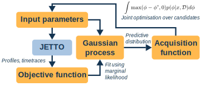
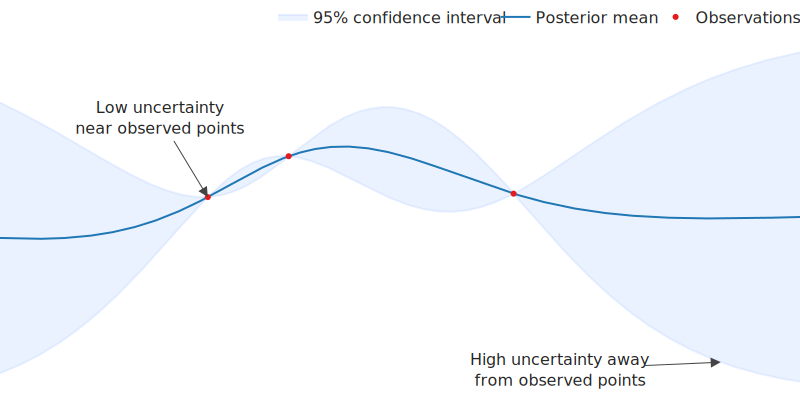
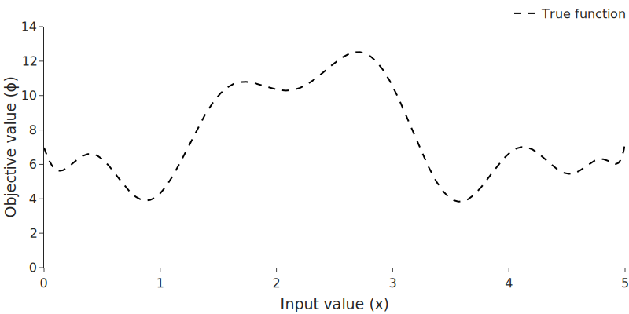
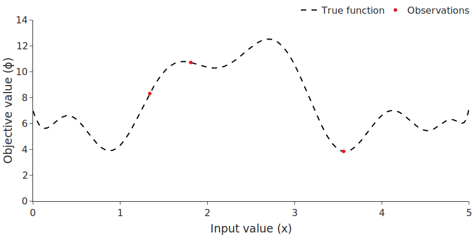
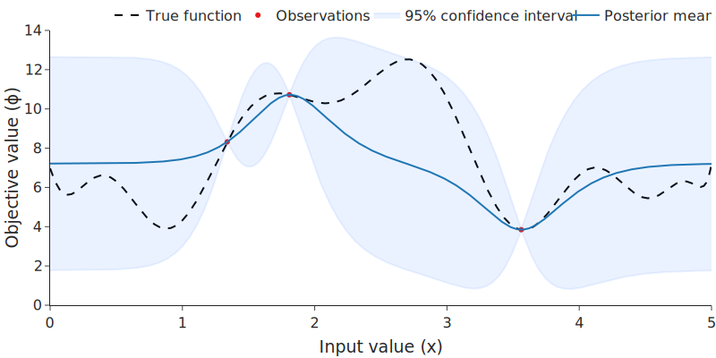
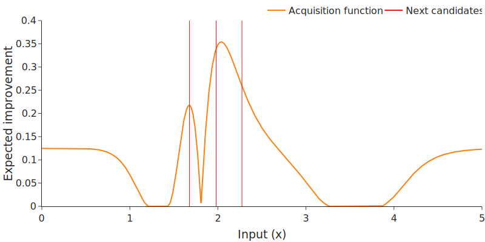
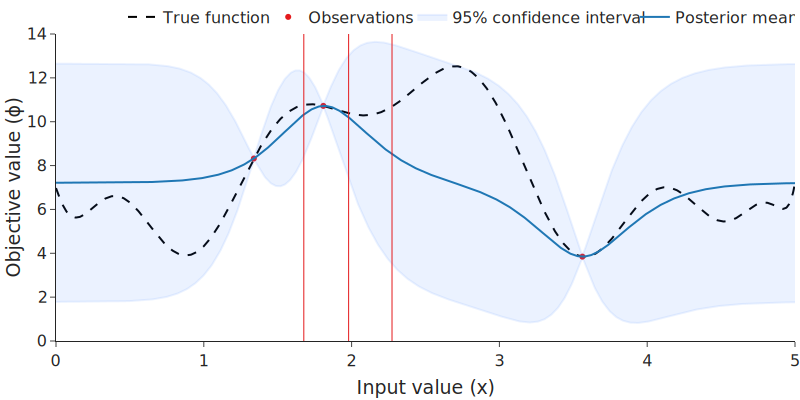
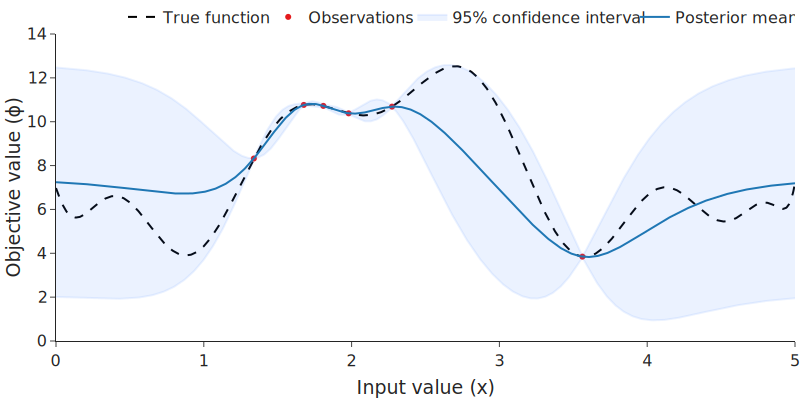
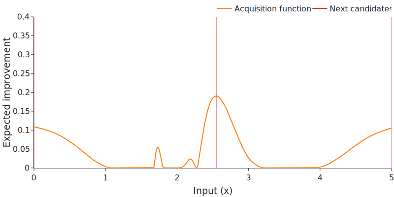
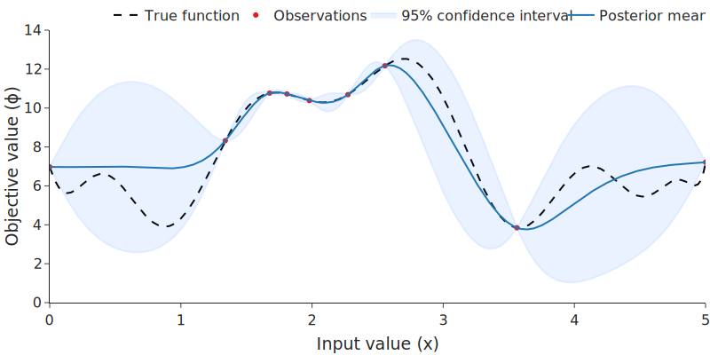

Bayesian optimisation
=====================

Introduction
------------
Bayesian optimisation (BO) is a principled approach to performing gradient-free global optimisation of costly black-box functions.

Global optimisation tasks involve a tradeoff between **exploitation** and **exploration**.
The core dilemma is whether we evaluate points in a region close to our current best guess of where the maximum is ('exploitation') or try out some points in a region where we don't have much knowledge, in the hope that it is better than what we've seen so far ('exploration').

Many global optimisation algorithms tackle this dilemma by introducing stochastic exploration; for example, in a genetic algorithm, random mutations are introduced in every generation. 
However, purely random exploration has no guarantee of robustness - we're not guaranteed to stumble upon (or even move near) the best solution.

Bayesian optimisation is a more principled method, using probabilistic inference to resolve the explore-exploit tradeoff.
BO is fully Bayesian, which means that it can incorporate all of the information gained at every step into the optimisation process.
It has two main components: a probabilistic model and an acquisition function.

    Flowchart of the BayesOpt method. A Gaussian process learns the mapping from input parameters to objective values, and an acquisition function selects the next inputs to evaluate.

Probabilistic model
-------------------
In BO, a model is fit to all of the previously observed input-objective pairs.
The model is then used to make predictions about the objective values of unseen inputs, which enables the optimiser to select points in a fully informed manner.

The model used is a *Gaussian process* (GP).
A GP is an extension of the multivariate Gaussian distribution to infinite dimensions, which means that instead of representing a probability distribution of a fixed number of variables it represents a probability distribution over *functions*.
The function that we are representing with the GP is the mapping from inputs to objective values.

Because a GP represents a Gaussian distribution, it provides both a mean and a variance at every point.
Hence, we have information about the expected performance as well as the uncertainty - a fact that can be used to resolve the explore-exploit tradeoff.

    An example of a Gaussian process fit to three observations.

Acquisition function
--------------------
The acquisition function is computed using the predictive distribution, and represents how 'useful' it would be to receive a new observation at each possible input point.
The acquisition function uses both the mean and the uncertainty of the GP model to resolve the explore-exploit tradeoff.

There are many different acquisition functions, that each represent a different approach to exploration and exploitation.
We use a version of Expected Improvement (EI) that is extended to incorporate noise, batch evaluation, and multiple objectives - snappily named "batch noisy expected hypervolume improvement" (qNEHVI) [#]_.

The core equation behind EI is:

.. math::
    \int \max(\phi - \phi^*, 0) p(\phi | x, \mathcal{D})d\phi

where `\phi = \phi(x)`:math: is the objective function, `x`:math: is the input, `\mathcal{D}`:math: is the set of past input-objective pairs, and `\phi^*`:math: is the best objective value seen so far.
Hence, `\max(\phi - \phi^*, 0)`:math: is the increase in objective value between a point `x`:math: and the best point we'd previously observed, and we take the expectation of this with respect to the predictive probability distribution over `\phi`:math:.

An inner optimisation loop is performed to find the argmax of the acquisition function, which is selected as the next point to trial.
In the batch setting (such as the `example in the next section <#example>`_), joint optimisation is performed to select the *set* of points that jointly maximise the acquisition function.

Example
-------
As our objective, we seek to find the input value `x`:math: that corresponds to the maximum output value `\phi`:math: of the following function:

The basic BO routine is:

    1. Observe initial values

    2. Fit probabilistic model

    3. Maximise acquisition function to select next input values

    4. Observe output values

    5. Repeat from 1

1. Observe initial values
~~~~~~~~~~~~~~~~~~~~~~~~~
   
At each optimisation step, we're allowed to observe the true value at a number of `x`-locations (in this case, 3).

.. tip:: To generate the initial sample locations, we recommend using **Sobol sampling**. 

    Sobol sampling uses a pseudorandom generator to produce a set of evenly distributed ('low-discrepancy') samples.
    In comparison with true random samples, Sobol samples provide a more complete coverage of the space, at the expense of being less 'random'.
    Ensuring coverage isn't particularly important in low dimensions, but becomes more important as the dimensionality and number of samples increases.
    Sobol sampling is widely used as an initialisation technique in optimisation tasks.

    .. figure:: images/sobol_vs_uniform.svg
        :width: 95%
        :figwidth: 95%

        Sobol sampling gives a better coverage of the space than uniform sampling

We select 3 input locations using Sobol sampling, and observe the true value of the objective function:

.. note:: In ``jetto-mobo``, this would be performed by:

  1. Using :func:`jetto_mobo.acquisition.generate_initial_candidates` to generate the input values
   
  2. Combining some problem-specific custom code with :func:`jetto_mobo.simulation.create_config` to create the JETTO configurations for each input value

  3. Using :func:`jetto_mobo.simulation.run_many` to run JETTO and produce JettoResults objects

  4. Using a function decorated with :func:`jetto_mobo.objectives.objective` to compute the objective values for each JettoResults object

2. Fit probabilistic model
~~~~~~~~~~~~~~~~~~~~~~~~~~

We train a GP model on the observations - the :math:`(x, \phi)` pairs - by maximising the marginal log likelihood. 
This method of model fitting robustly balances the goodness of the model fit with the model complexity, preventing overfitting.

.. note:: In ``jetto-mobo``, this is performed by :func:`jetto_mobo.surrogate.fit_surrogate_model`.

3. Optimise acquisition function to select next input values
~~~~~~~~~~~~~~~~~~~~~~~~~~~~~~~~~~~~~~~~~~~~~~~~~~~~~~~~~~~~

We compute the acquisition function (orange) - in this case, qEI - and then perform joint optimisation on the acquisition function to select the next 3 :math:`x` locations where we'll observe the objective value :math:`\phi`:

In this case, qEI suggests trying a point either side of the current predicted peak, and one a bit further along which is in a region of lower confidence.

.. note:: In ``jetto-mobo``, this is done by :func:`jetto_mobo.acquisition.generate_trial_candidates`.

4. Observe output values
~~~~~~~~~~~~~~~~~~~~~~~~

As in step 1, we observe the value of the objective function :math:`\phi` at the selected locations.
We then update the model:

.. note:: In ``jetto-mobo``, you will need to write custom code to take the candidate values from :func:`jetto_mobo.acquisition.generate_trial_candidates` and generate a JETTO config. We also provide :func:`jetto_mobo.simulation.create_config` to simplify the manipulation of ``JettoConfig`` objects.

    Once a config is generated, you can run it with :func:`jetto_mobo.simulation.run_many`.

5. Repeat
~~~~~~~~~

Repeat the above steps until you've achieved a satisfactory result!

    GP model from step 4.

    Acquisition function with next candidates. Note the candidates at the boundaries of the domain (:math:`x=0`, :math:`x=5`).

    Updated GP model with new observations.

Additional resources
--------------------
- `Rich Turner's introductory lecture on Gaussian processes <https://youtu.be/92-98SYOdlY>`_
- `Textbook on Gaussian processes (Rasmussen & Williams) <https://gaussianprocess.org/gpml/>`_
- `Textbook on Bayesian optimisation (Garnett) <https://bayesoptbook.com/>`_
- `BoTorch qNEHVI tutorial <https://botorch.org/tutorials/multi_objective_bo>`_

.. [#] Daulton et al., "Parallel Bayesian Optimization of Multiple Noisy Objectives with Expected Hypervolume Improvement," `arXiv:2105.08195 <https://arxiv.org/abs/2105.08195>`_, 2021
      