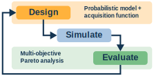

########################
jetto_mobo documentation
########################
*Multi-objective Bayesian optimisation for JETTO in Python*

    ``jetto_mobo`` brings together tools for optimisation (design), running JETTO (simulation), and for evaluating the optimisation results (evaluation)

``jetto_mobo`` is a Python package for performing multi-objective Bayesian optimisation (BO) in the JETTO plasma modelling code.
It is a slim wrapper around `BoTorch`_, a library for Bayesian optimisation in PyTorch.
JETTO is run using `Singularity/Apptainer`_.

The project's aim is to provide a plug-and-play package for performing plasma scenario optimisation in JETTO.
This means less faffing around with PyTorch tensors and boilerplate, allowing users to leverage the power of model-based optimisation without requiring familiarity with machine-learning libraries.

We want to provide a **simple drop-in replacement** that allows users to easily switch to using a **more efficient** and **interpretable** optimisation algorithm.

.. _BoTorch: https://botorch.org/
.. _Singularity/Apptainer: https://apptainer.org/

Contents
--------
.. toctree::
   :maxdepth: 2

   about
   installation
   usage
   reference
   publications
   contributing

Useful links
------------
- `Source code <https://github.com/theo-brown/jetto-mobo>`_
- `jetto-pythontools documentation <https://gitlab.com/jintrac/jetto-pythontools>`_
- `BoTorch documentation <https://botorch.org/docs/introduction>`_
- `Singularity (Apptainer) documentation <https://apptainer.org/docs/user/latest/>`_
