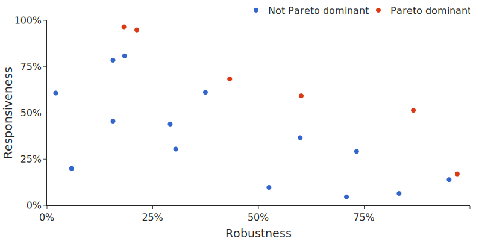
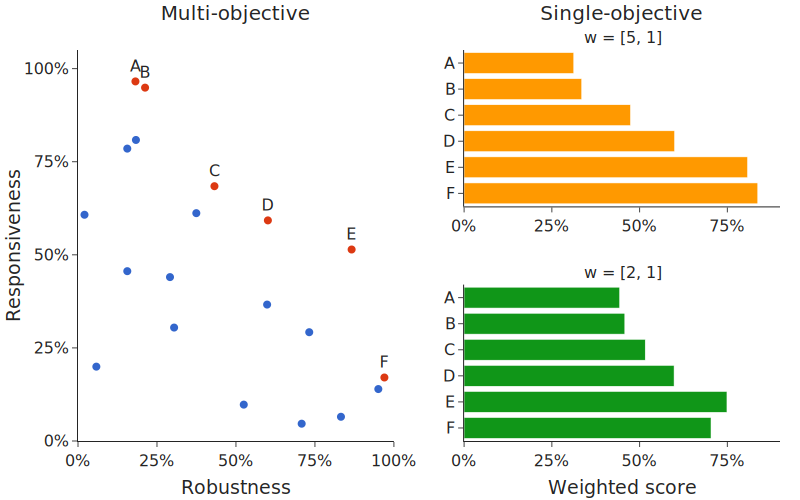
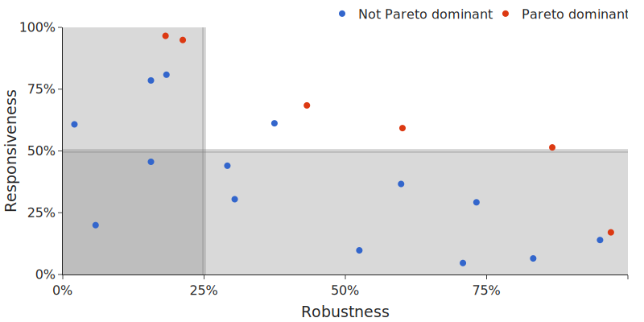

Multi-objective optimisation
============================

In *single-objective* optimisation tasks, there is one metric of interest. Each solution is assigned a single scalar value.

In *multi-objective* optimisation tasks, there are multiple metrics of interest; each solution is assigned a *vector* of values, where each element represents the performance under one of the objective functions.

.. tip:: Sometimes, a multi-objective optimisation task can be cast to a single-objective task by introducing prior knowledge about the *relative importance* of the different objectives in the form of a weighting vector.

    However, applying a weighting vector introduces preconceptions about the tradeoff we want to make, and our optimisation algorithm will produce solutions that line up with our expectations.

    **By taking a true multi-objective (vector) approach, we gain understanding of how the objectives interact and conflict, and can make a reasoned choice after observing all of the possible solutions.**

    Whether it is better to take a multi-objective or single-objective approach to optimisation depends on your application.
    See `Multi-objective vs single-objective`_ for more detail.

Pareto optimality
-----------------
In the single-objective framework, comparing the performance of two different solutions is easy, as it just requires comparing two scalars.
Comparing multi-objective (vector) solutions is not as straightforward - solution A might be better than B in some objectives, but worse in others.

In many real-world tasks, we're often interest in finding solutions that represent *optimal tradeoffs* between *multiple objectives*.
This is particularly the case when there is a fair amount of freedom in the choice of tradeoff.

For example, consider a 'responsiveness vs robustness' dilemma: a robot controller needs to have quick reactions to stimuli (responsiveness) but must also not react to noise and unwanted disturbances (robustness).

If we're still in the design phase, we might be unsure about the desired level of responsiveness or robustness, and might want to explore the solution space to evaluate the tradeoffs.
However, maybe we have limited testing capacity and can only evaluate a few candidate controllers.
As we can't exhaustively compute the performance boundary, we might end up with a plot like the following:

The points shown in red represent the optimal solutions to the tradeoff between responsiveness and robustness; they are known as the *Pareto set*, which comprises of points that are *Pareto dominant*.

.. important:: A solution is **Pareto dominant** if it is impossible to improve its performance in any objective without decreasing its performance in another objective.

Although easy to visualise in this 2D toy example, the Pareto dominance criterion becomes less intuitive in higher dimensions.
In particular, the dimensionality of the Pareto set increases as the number of objective functions increases, which means that in high dimensions a large proportion of the evaluated points are Pareto optimal.

It's also important to note that the Pareto optimal solutions lie on a continuous manifold, rather than a discrete set.
Good multi-objective optimisation algorithms will try to find a diverse representation of the Pareto manifold.

Multi-objective vs single-objective
-----------------------------------

To see the advantages of a true multi-objective approach to analysis, consider the robustness/responsiveness problem with the following weighting function:

.. math::
    \text{weighted score} = \frac{w_0 \times \text{robustness} + w_1 \times \text{responsiveness}}{w_0 + w_1}

The solutions with different values of :math:`w = [w_0, w_1]` are shown below.

Note that **the resulting solution varies depending on the exact choice of the weights**: :math:`w = [5, 1]` suggests that F is the best solution, but :math:`w = [2, 1]` suggests E as the best solution.
Without looking at a multi-objective representation, we can't understand *why* we might choose F over E and vice versa.

This is not a major problem if we have high confidence in our choice of weights; however, in design situations, we often have a decent bit of freedom in making the tradeoff.
For example, in the controller setting, we might be able to get away with reduced robustness by using more expensive sensors that have less noise.
If that's the case, we would prefer to take a small reduction in robustness (~10%) for a massive improvement in responsiveness (~30%).

By performing true multi-objective optimisation - where we formulate the problem as a multi-objective problem from the beginning, and seek to evaluate the Pareto front - we ensure that we are **accurately representing the tradeoffs throughout the optimisation process**, rather than constraining the optimiser to a pre-determined way of resolving tradeoffs.

Introducing constraints
-----------------------

If you already have some prior domain knowledge, it might be that you want to introduce some constraints to the solution space.

A common example is introducing lower bounds to objective functions.
In the controller example, we might want to disregard any points that have robustness lower than 25% or responsiveness lower than 50%.

There is a choice of approaches for dealing with constraints.

For maximum interpretability, you can run the unconstrained optimisation and then mask the final solutions with your constraint functions.
The advantage of this method is that you can understand the impact of the constraints; for example, in the above figure, slackening the robustness constraint to 20% would enable significant performance improvements.

However, the problem with masking in post-processing is that the optimiser may have wasted a lot of resources exploring regions that will be masked out. If efficiency is a higher priority, you should modify the objective functions so that they return 0 for solutions that violate the constraints.
